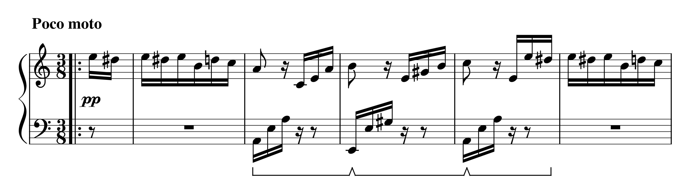

# pyogi-notation

[](https://github.com/hoffa/notation/actions/workflows/build.yml)
[](https://creativecommons.org/licenses/by-nc-nd/4.0/)

A simpler music notation for casual piano learners. Still a work in progress.

## Why?

I'm bad at piano but I'm trying to learn by myself, and I find modern music notation overwhelming.

For example:

1. Why does the note corresponding to a line on the [staff](<https://en.wikipedia.org/wiki/Staff_(music)>) depend on (1) the [clef](https://en.wikipedia.org/wiki/Clef), (2) the [key signature](https://en.wikipedia.org/wiki/Key_signature), and (3) the [accidental](<https://en.wikipedia.org/wiki/Accidental_(music)>) next to a note? I need to look in 3 places just to know which key to press.
1. Why have both C♯ and D♭ when they correspond to the same key?
1. Why aren't staff lines for different [octaves](https://en.wikipedia.org/wiki/Octave) consistent? If a note is on a solid line, the same note one octave higher is on a blank line.

## Comparison

Here's the beginning of Claude Debussy's [Arabesque No. 1](https://en.wikipedia.org/wiki/Two_Arabesques) in modern musical notation:



And here using the Pyogi notation:

<p align="center">
  
</p>

See [here](https://raw.githubusercontent.com/hoffa/notation/main/testdata/output/debussy-deux-arabesques.svg) for the full composition, and [`examples.md`](examples.md) for more examples.

## The notation in 1 minute

- Thick lines are [C notes](<https://en.wikipedia.org/wiki/C_(musical_note)>).
- The higher the note, the higher the pitch.
- White notes are naturals.
- Black notes are sharps.

There are no explicit flats, rests, note values, time signatures, key signatures, etc. Play what sounds good.

## Usage

```bash
./render.sh score.mxl > score.svg
```

Where `score.mxl` is a compressed [MusicXML](https://en.wikipedia.org/wiki/MusicXML) file.

## Development

Set up dependencies:

```bash
make init
```

Run tests:

```bash
make test
```

If the rendering changes, tests can be quickly updated with:

```bash
UPDATE=1 make test
```
