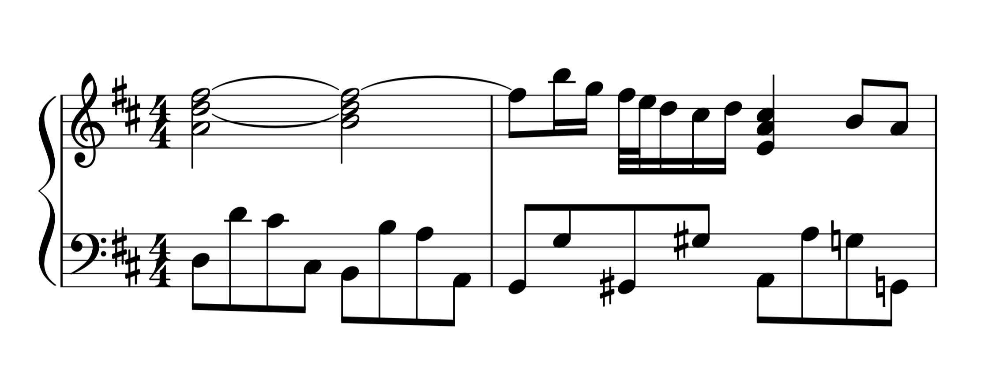
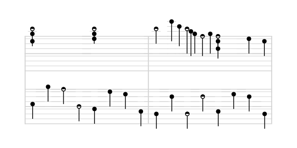

# notation

I got frustrated with the inconsistencies and (what I perceived as) unnecessary complexity in modern music notation. All I want to know is where to put my fingers. Note length, tempo, velocity, progression and other stuff are minor worries in comparison.

I wanted to create a simple and consistent music notation, along with parsers, converters and whatnot. Turns out writing beautiful renderers is tough, and it can get quite ugly with edge cases and the variety of sheets out there. I haven't yet had the motivation to finish anything considerable, so instead for some peace of mind, I'm documenting the envisioned notation here.

This is written from the perspective of a clueless piano beginner who just wants to play.

## Comparison

I haven't spent much time on tuning the rendering; this is just to give a rough idea.

### Modern notation



([source](https://musescore.com/user/94656/scores/891176))

### This notation



## Usage

I've included a barebones parser and renderer. I'm trying to keep the code as short and simple as possible, and focus on ironing out the worst of issues. I don't want to deal with wrapping, justification and the plethora of other visual adjustments at this point.

Here's the basic usage:

```shell
./parse.py song.mxl | ./render.py
```

## Format

### Staves


* Thick lines always represent [C notes](https://en.wikipedia.org/wiki/C_(musical_note)), no matter the [key](https://en.wikipedia.org/wiki/Key_(music)).
* [Measures](https://en.wikipedia.org/wiki/Bar_(music)) are separated by vertical lines.
* [Time signatures](https://en.wikipedia.org/wiki/Time_signature) and [key signatures](https://en.wikipedia.org/wiki/Key_signature) are not shown.
* Changes in [octave](https://en.wikipedia.org/wiki/Octave) are indicated using a signed number at the start of the measure.

### Notes

[Note value](https://en.wikipedia.org/wiki/Note_value) and [accidental](https://en.wikipedia.org/wiki/Accidental_(music)) are encoded in the shape of the note.

[Natural](https://en.wikipedia.org/wiki/Natural_(music)), [sharp](https://en.wikipedia.org/wiki/Sharp_(music)) and [flat](https://en.wikipedia.org/wiki/Flat_(music)) notes have the following shapes:


### Rests

[Rests](https://en.wikipedia.org/wiki/Rest_(music)) aren't explicitly displayed.

### Stem length

The stem is horizontal, and as long as the note duration.
