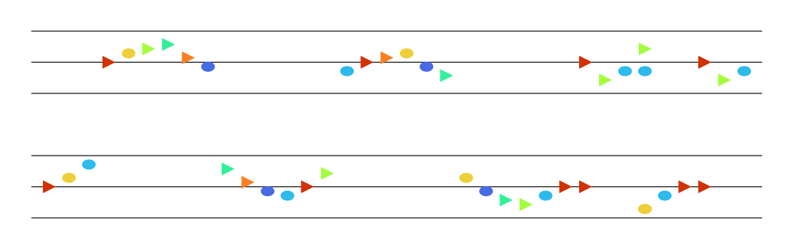
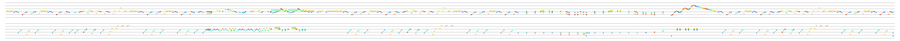
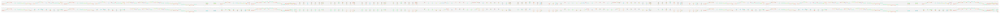

# Examples
## [`testdata/output/chopin-trois-valses.svg`](https://raw.githubusercontent.com/hoffa/notation/main/testdata/output/chopin-trois-valses.svg)

## [`testdata/output/chopin-trois-valses-turbo.svg`](https://raw.githubusercontent.com/hoffa/notation/main/testdata/output/chopin-trois-valses-turbo.svg)

## [`testdata/output/chopin-trois-valses-mono.svg`](https://raw.githubusercontent.com/hoffa/notation/main/testdata/output/chopin-trois-valses-mono.svg)

## [`testdata/output/debussy-deux-arabesques-short.svg`](https://raw.githubusercontent.com/hoffa/notation/main/testdata/output/debussy-deux-arabesques-short.svg)

## [`testdata/output/debussy-deux-arabesques-short-turbo.svg`](https://raw.githubusercontent.com/hoffa/notation/main/testdata/output/debussy-deux-arabesques-short-turbo.svg)

## [`testdata/output/debussy-deux-arabesques-short-mono.svg`](https://raw.githubusercontent.com/hoffa/notation/main/testdata/output/debussy-deux-arabesques-short-mono.svg)

## [`testdata/output/debussy-deux-arabesques.svg`](https://raw.githubusercontent.com/hoffa/notation/main/testdata/output/debussy-deux-arabesques.svg)

## [`testdata/output/debussy-deux-arabesques-turbo.svg`](https://raw.githubusercontent.com/hoffa/notation/main/testdata/output/debussy-deux-arabesques-turbo.svg)

## [`testdata/output/debussy-deux-arabesques-mono.svg`](https://raw.githubusercontent.com/hoffa/notation/main/testdata/output/debussy-deux-arabesques-mono.svg)

## [`testdata/output/fur-elise.svg`](https://raw.githubusercontent.com/hoffa/notation/main/testdata/output/fur-elise.svg)

## [`testdata/output/fur-elise-turbo.svg`](https://raw.githubusercontent.com/hoffa/notation/main/testdata/output/fur-elise-turbo.svg)

## [`testdata/output/fur-elise-mono.svg`](https://raw.githubusercontent.com/hoffa/notation/main/testdata/output/fur-elise-mono.svg)

## [`testdata/output/piano-sonata-no-14.svg`](https://raw.githubusercontent.com/hoffa/notation/main/testdata/output/piano-sonata-no-14.svg)

## [`testdata/output/piano-sonata-no-14-turbo.svg`](https://raw.githubusercontent.com/hoffa/notation/main/testdata/output/piano-sonata-no-14-turbo.svg)

## [`testdata/output/piano-sonata-no-14-mono.svg`](https://raw.githubusercontent.com/hoffa/notation/main/testdata/output/piano-sonata-no-14-mono.svg)

## [`testdata/output/schubert-allegretto.svg`](https://raw.githubusercontent.com/hoffa/notation/main/testdata/output/schubert-allegretto.svg)

## [`testdata/output/schubert-allegretto-turbo.svg`](https://raw.githubusercontent.com/hoffa/notation/main/testdata/output/schubert-allegretto-turbo.svg)

## [`testdata/output/schubert-allegretto-mono.svg`](https://raw.githubusercontent.com/hoffa/notation/main/testdata/output/schubert-allegretto-mono.svg)

